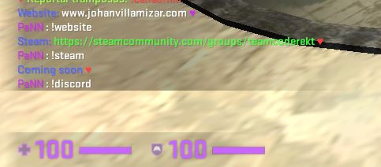

<p align="center">
    </a>&nbsp;
    <a href="https://wiki.alliedmods.net/Introduction_to_SourcePawn_1.7"> </a>&nbsp;
    <a href="https://www.sourcemod.net/"> </a>&nbsp;
    
    
</p>

# InfoChat
_Plugin that allows you to add information commands to your server._ 

<br>

## Detailed description 🧾

It consists of adding information commands within the server (for example:  __!command__ ), which when the client writes it, the information will be printed in the chat. This message will only be seen by the person typing the command.

It is a very useful plugin when players want to know a link, information, etc. What you imagine. 

By default there are three highly requested commands such as the __!discord__ , __!steam__ and __!website__ commands. More commands and variations can be added by modifying the code if you already have knowledge.

## Commands

* !discord
* !steam
* !website
  
## Preview



## Version 1.0

* Commands from source code
* Messages from the translations file
* Default discord, steam and website commands
* Multi language


## Installation 🔧

Upload the respective folders

```
addons/sourcemod/plugins
```
```
addons/sourcemod/translations
```

---
❤️ by [Johan Villamizar](https://johanvillamizar.com) 😊

